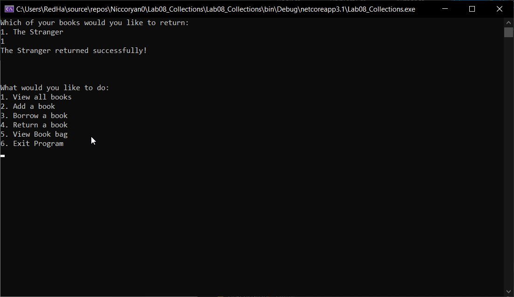
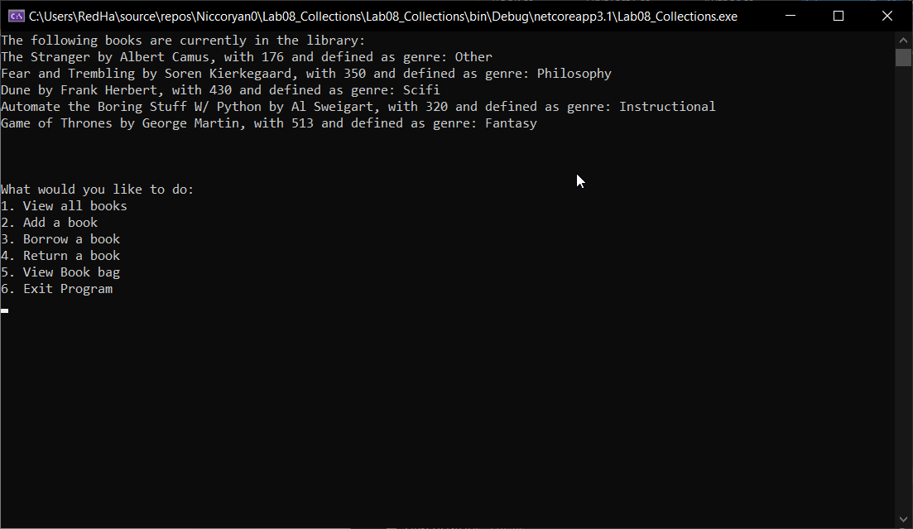
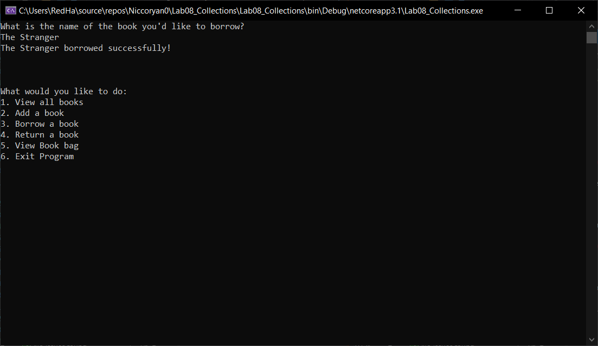

# Lab 08 - Collections
*Author: Nicco Ryan*

----

## Description
### This console application simulates a Lending Library filled with books in order to showcase Collections.
---

### Getting Started
Clone this repository to your local machine.

```
$ git clone https://github.com/Niccoryan0/Lab08_Collections.git
```

### To run the program from Visual Studio:
Select ```File``` -> ```Open``` -> ```Project/Solution```

Next navigate to the location you cloned the Repository.

Double click on the ```Lab08_Collections``` directory.

Then select and open ```Lab08_Collections.sln```

---

### Visuals
#### App start page

#### Viewing all books in library

#### Borrowing a book

#### Returning a book


---

### Change Log
1.0: *Initial release* - 15 July 2020